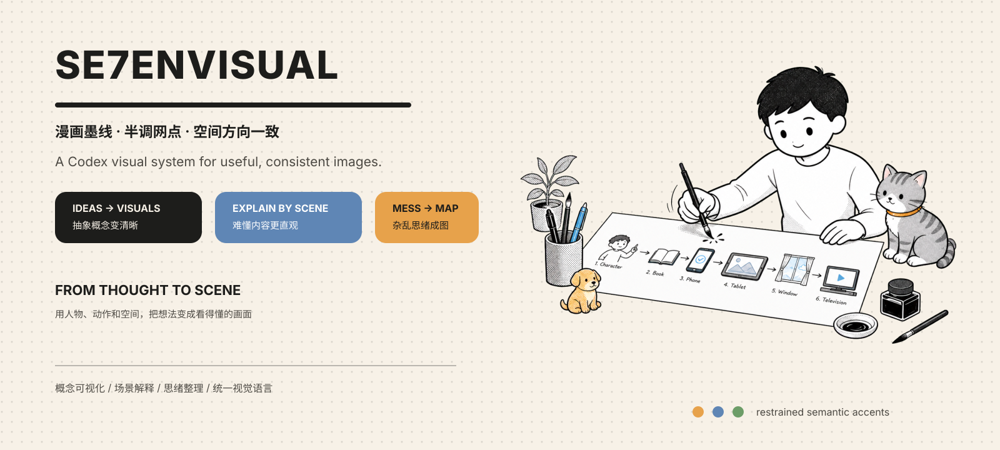
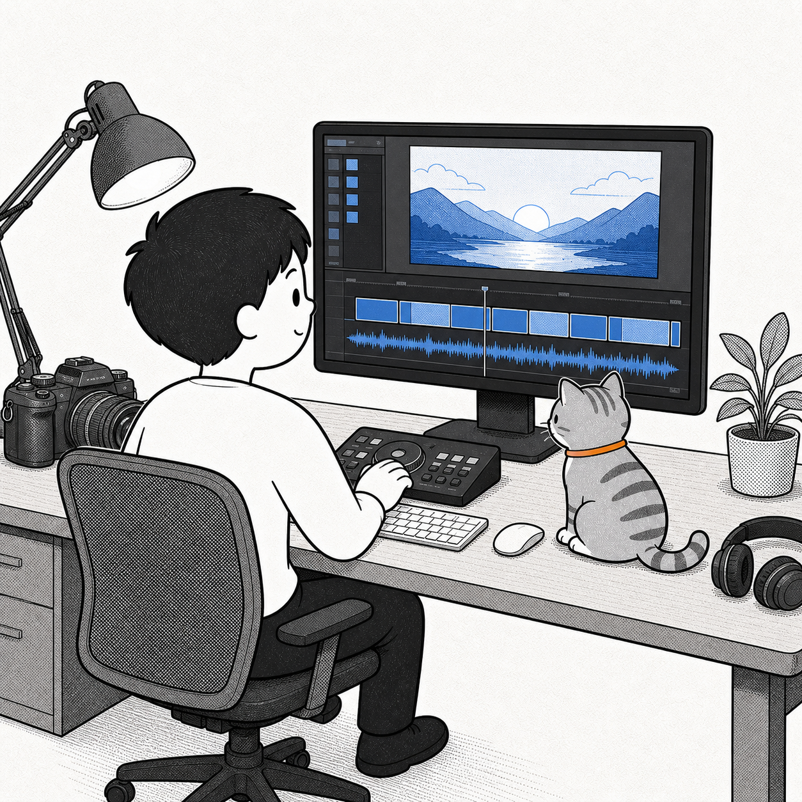
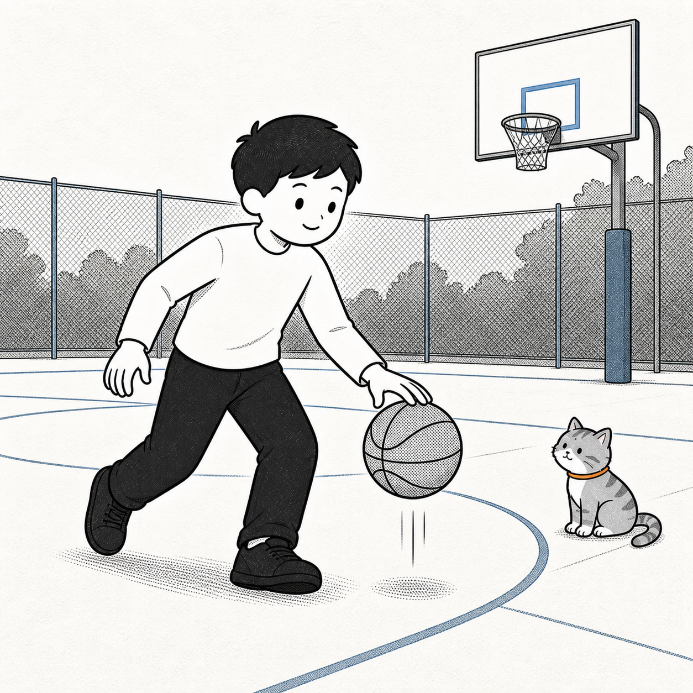
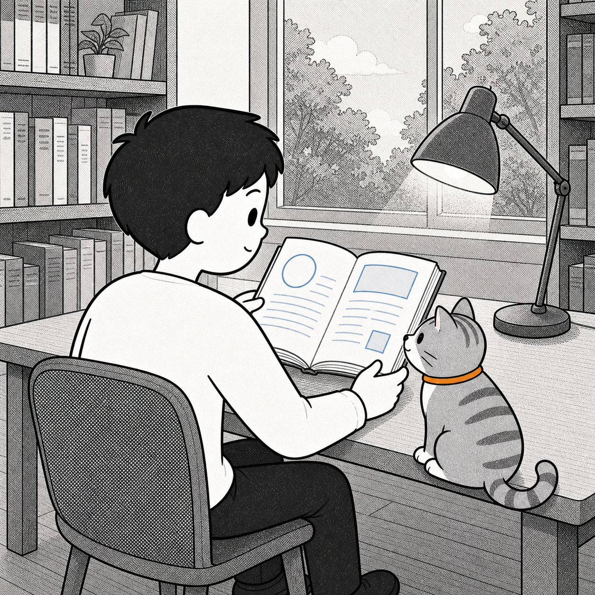
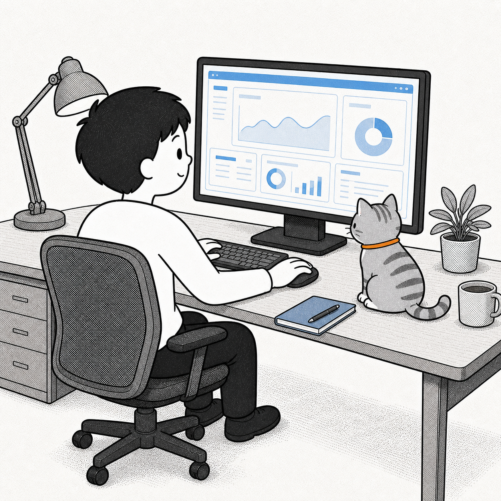
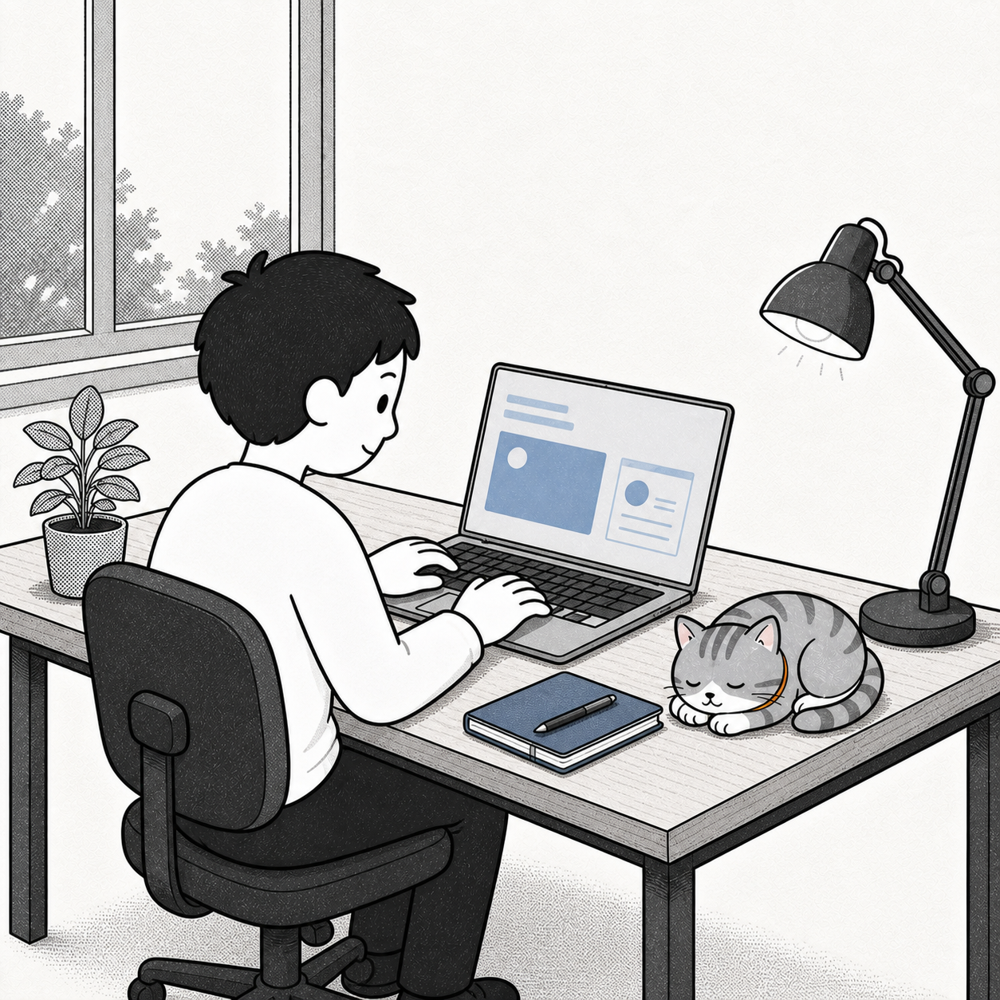
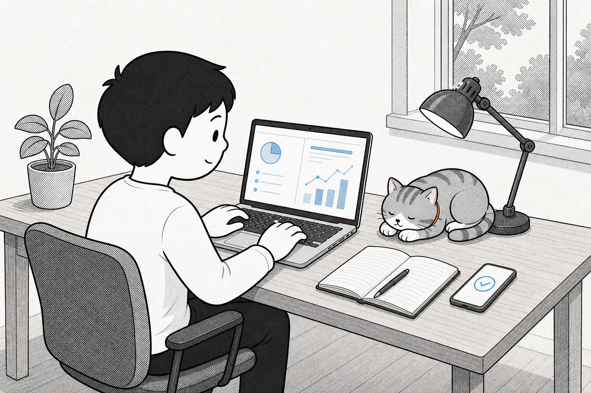

<p align="center">
  
</p>

<p align="center">
  <strong>SE7ENVISUAL</strong><br>
  面向 Codex 的统一漫画墨线配图规范
</p>

`se7en-visual` 是一套用于 Codex 图片生成的视觉与空间规则。它把角色身份、墨线、半调网点、颜色、场景、物体正反面和画幅比例统一起来，让不同主题的图片保持同一种视觉语言，同时减少“屏幕背面出现 UI”“书页方向反了”“人物和物体互相穿透”等反现实问题。

适合生成概念解释、机制流程、视频剪辑、办公、运动、阅读、信息整理、对比关系和角色场景。

## 这套规则解决什么

- **角色一致**：固定一个圆润年轻男性和一只灰色虎斑猫，保持发型、服装、花纹、白口鼻、白爪和橙色项圈一致。
- **风格一致**：黑色粗细变化的漫画墨线、圆形半调网点、米白纸张质感和克制的语义色。
- **空间正确**：电脑、手机、平板、电视、书本、纸张、窗户、镜子、门、包装和家电都必须遵守真实的正反面、内外侧、开口和遮挡关系。
- **角度自适应**：不要求用户每次指定人物角度；根据主要信息面自动选择正面、侧面、后侧三分之四或越肩视角。
- **画幅可控**：没有指定时默认 `1:1`；指定比例或方向时严格执行对应画幅。
- **猫的状态可变**：猫可以睁眼观察、互动、走动、坐着、休息或睡觉，不会每张图都固定成睡觉姿势。

## 配图风格

- 用有粗细变化的黑色墨线画轮廓和细节。
- 用圆形半调网点表现灰面和阴影，不使用柔和渐变。
- 使用米白色、轻微纹理的真实环境，只保留帮助理解的道具。
- 基础色为黑、米白和半调灰；猫的项圈固定使用低饱和橙色。
- 语义色最多增加两种，优先使用蓝色表示内容、橙色表示动作或警示、紫色表示过程、绿色表示成功结果。
- 需要文字时，只使用短标签，并把文字放在对应的真实证据表面上。
- 禁止狗、额外动物、重复角色、眼镜、细线火柴人、3D、写实照片、炫光渐变、模板化仪表盘和水印。

## 视角与物体方向

人物角度不是固定模板，而是由场景的主要信息决定：

| 场景 | 优先视角 | 原因 |
| --- | --- | --- |
| 视频剪辑、电脑办公 | 侧后方、后侧三分之四、越肩 | 屏幕正面、键盘、手和视线在同一侧 |
| 阅读、写字 | 后侧三分之四、越肩 | 书页内容和读者动作更自然 |
| 打篮球、运动 | 侧面或三分之四 | 球、手、脚、重量和运动方向更清楚 |
| 普通交流、人物肖像 | 正面或正面三分之四 | 没有方向性物体冲突 |

两种显示器构图都允许：

- **看得到内容**：屏幕正面同时朝向人物和镜头，UI 只能出现在真实屏幕平面内。
- **看不到内容**：显示器背面朝向镜头，屏幕正面朝向人物但被遮挡；镜头只看到后壳、支架、接口或外框，背面不得出现 UI、文字、图片、边框或发光。

人物可以保持正面而让物体显示背面，但人物的脸、视线、手、物体功能面和遮挡必须在同一个真实空间里。不能为了露出人物正脸，让人物看穿显示器或让书页、屏幕出现在错误的一面。

## 画幅比例

默认使用 `1:1`。用户给出比例或方向时按下表执行：

| 用户说法 | 画幅 |
| --- | --- |
| `1:1`、正方形 | 1:1 |
| `4:3` | 横向 4:3 |
| `16:9` | 宽屏横向 16:9 |
| `3:4` | 竖向 3:4 |
| “纵向”、`portrait`、`9:16` | 竖屏 9:16 |

不要把已经指定的比例静默替换成正方形，也不要先画正方形后再强行裁剪成其他比例。

## 示例

<p align="center">
  
  
  
</p>

<p align="center">
  
  
  
</p>

## 安装

将仓库放到 Codex skills 目录：

```bash
git clone https://github.com/your-account/se7en-visual.git ~/.codex/skills/se7en-visual
```

重启 Codex，然后在对话中点名使用：

```text
Use $se7en-visual to create a rear three-quarter video-editing scene.
Keep the monitor's front screen facing the person and camera, with no UI on the rear casing.
Use a 1:1 square canvas and keep the cat awake and observing.
```

也可以直接用中文描述主题；没有指定人物角度时，skill 会根据屏幕、书页、工具或动作的主要信息面自动选择视角。

## 推荐的描述方式

描述一个有方向性物体的场景时，明确这四件事最稳定：

```text
主题：一个人在电脑前办公。
人物角度：由 skill 根据屏幕和操作关系自动选择；优先物理正确的侧后方或越肩视角。
物体方向：屏幕正面朝向人物和镜头，UI 只能在真实屏幕内；显示器背面保持纯后壳。
画幅：默认 1:1；如果指定“纵向”，使用 9:16。
```

如果你想要“人物正面、电脑背面”，可以直接说：

```text
人物正面面对镜头，显示器背面朝向镜头；屏幕正面朝向人物但不可见。
镜头只能看到显示器后壳、支架、接口和连接线，背面禁止出现 UI、文字、图片或屏幕边框。
```

## 输出模式

### Mode A：完整解释图

用于概念、机制、流程、对比和场景说明。输出完整 PNG 或 WebP，场景本身需要在约 10 秒内讲清主要关系。

### Mode B：可复用角色插图

用于文档、卡片、幻灯片或页面组合。使用纯色抠像背景生成，再通过 `scripts/cutout.py` 去除背景，输出透明 PNG。

```bash
python scripts/cutout.py source.png transparent.png
```

## 目录

```text
se7en-visual/
├── SKILL.md                         # 主技能规则
├── references/
│   ├── character-lock.md            # 角色身份锁定
│   └── prompt-patterns.md           # 提示词与重试模板
├── assets/
│   └── se7en-character-reference.png # 必须附加的角色参考图
├── scripts/
│   └── cutout.py                    # Mode B 背景去除
└── output/                          # 已批准的生成示例
```

## 交付检查

- 三秒内能认出同一个年轻男性和同一只灰色虎斑猫。
- 十秒内能理解主要动作或关系。
- 所有屏幕、书页、文件、手机、窗户、镜子和工具的内容都位于真实功能面。
- 人物视线、手势、支撑、阴影、遮挡和物体厚度符合一个相机视角。
- 猫的眼睛和姿态符合场景，不默认每张图都睡觉。
- 画幅符合默认值或用户明确指定的比例。
- 没有狗、额外动物、重复角色、错误文字或水印。

## 参考

README 的信息顺序和“真实项目素材优先、视觉与 Markdown 分层”的组织方式参考了 [`beautify-github-readme`](https://github.com/oil-oil/beautify-github-readme)；本 README 的规则和示例均以当前仓库实际内容为准。
